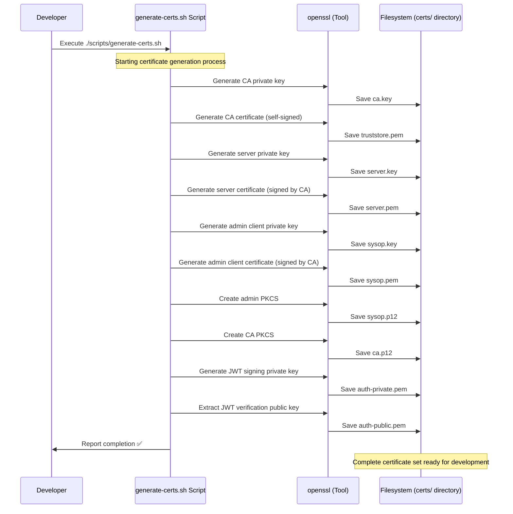

# Diagram 1: Development Certificate Generation

This diagram illustrates the automated process of generating a complete set of certificates for a local development environment using the provided helper script. This process is designed for convenience and rapid setup, and should not be used for production environments.

### Step-by-Step Explanation

1. **Initiation**: A `Developer` starts the process by running the `./scripts/generate-certs.sh` script.
2. **CA Creation**: The script first creates a local Certificate Authority (CA). It invokes `openssl` to generate a private key (`ca.key`) and a self-signed public certificate (`truststore.pem`). This `truststore.pem` will serve as the root of trust for all other components.
3. **Server Certificate**: Next, the script generates a certificate for the `arrowhead-lite` server itself. This involves creating a key (`server.key`) and a Certificate Signing Request (CSR), which is then signed by the newly created CA. The resulting `server.pem` is what the server will present to clients.
4. **Admin Client Certificate**: The script creates a certificate for the administrative user, "sysop". This certificate has `CN=sysop` and grants administrative privileges for management APIs.
5. **Bundling for SDKs**: To make the certificates easy to use for client SDKs (like the Python SDK), the script creates PKCS#12 bundles (`.p12` files). These files package a private key and its corresponding public certificate together.
   - `sysop.p12`: For administrative tasks.
   - `ca.p12`: A keystore containing the CA's identity, used by SDKs to register new systems with `arrowhead-lite`'s built-in CA.
6. **JWT Keys**: Finally, the script generates an RSA key pair (`auth-private.pem` and `auth-public.pem`) used for signing and verifying JSON Web Tokens (JWTs) during orchestration.
7. **Completion**: All certificates and keys are saved to the `certs/` directory, and the script confirms completion to the developer.

## Generated Files

- **CA**: `ca.key`, `truststore.pem`, `ca.p12`
- **Server**: `server.key`, `server.pem`
- **Admin Client**: `sysop.key`, `sysop.pem`, `sysop.p12`
- **JWT Keys**: `auth-private.pem`, `auth-public.pem`

## Security Notice

⚠️ **These certificates are self-signed and intended for development only.** Do not use in production environments.