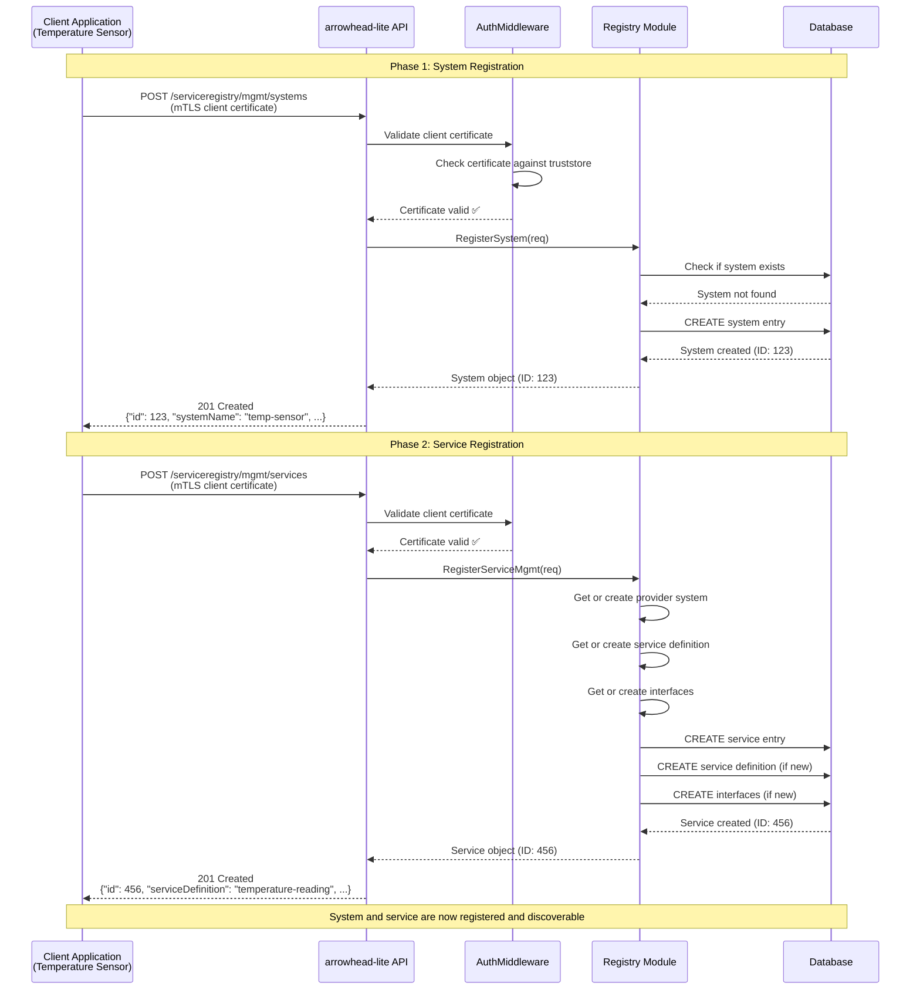

# Diagram 2: System and Service Registration

This diagram shows the two-stage process for a client application to become a known entity within the Arrowhead cloud. First, the system itself must be registered. Second, the specific services it provides are registered. Both steps require mTLS authentication using a pre-provisioned client certificate.

### Step-by-Step Explanation

1. **System Registration Request**: A `Client Application` (e.g., a temperature sensor) initiates contact by sending a `POST` request to the `/serviceregistry/mgmt/systems` endpoint. The request is authenticated using its client certificate.
2. **Authentication**: The `arrowhead-lite API`'s middleware intercepts the request. It verifies that the client's certificate was signed by a trusted CA (as defined in the server's `truststore.pem`). If valid, the system's identity (from the certificate's Common Name) is extracted.
3. **Registry Logic**: The API handler passes the request to the internal `Registry Module`.
4. **Database Write**: The `Registry Module` creates a new record for the system in the `Database`.
5. **Confirmation**: A `201 Created` response is sent back to the client, confirming that the system is now registered.
6. **Service Registration Request**: With the system now registered, the client can register the services it offers. It sends a `POST` request to `/serviceregistry/mgmt/services`, detailing the `serviceDefinition` (e.g., "temperature-reading") and `interface` (e.g., "HTTP-SECURE-JSON") it provides.
7. **Authentication (Again)**: This request is also authenticated via mTLS.
8. **Registry & Database**: The `Registry Module` processes the request, creating entries for the service and linking it to the provider system and its interfaces in the `Database`. If the `serviceDefinition` or `interface` are new, `arrowhead-lite`'s registry will create them automatically.
9. **Final Confirmation**: A `201 Created` response is returned, confirming the service is now discoverable by other systems.

## Key Points

1. **mTLS Authentication**: All requests require valid client certificates
2. **Two-Step Process**: Systems must be registered before their services
3. **Automatic Creation**: Related entities (service definitions, interfaces) are created automatically
4. **Database Persistence**: All registration data is stored in the database for discovery

## Authentication Flow

The `AuthMiddleware` validates client certificates by:
- Checking certificate validity and trust chain
- Extracting system name from certificate Common Name
- Looking up system in database (unless it's a sysop certificate)
- Setting authentication context for the request