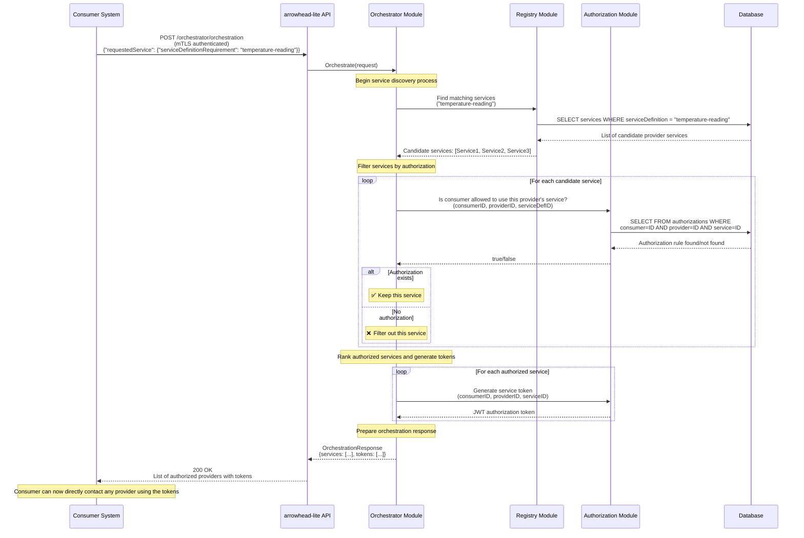

# Diagram 3: Service Orchestration Flow

Orchestration is the core "matchmaking" process in Arrowhead. This diagram details how a `Consumer System` discovers a suitable `Provider System` for a specific need. The process involves collaboration between the Orchestrator, Registry, and Authorization modules to ensure the match is not only functional but also permitted.

### Step-by-Step Explanation

1. **Orchestration Request**: A `Consumer System` that needs a service sends a `POST` request to the `/orchestrator/orchestration` endpoint. The request specifies *what* it needs (the `serviceDefinitionRequirement`) and *how* it can communicate (the `interfaceRequirements`).
2. **Find Potential Providers**: The `Orchestrator Module` receives the request and immediately asks the `Registry Module` to find all services that match the requested `serviceDefinition`.
3. **Registry Database Query**: The `Registry Module` queries the `Database` to retrieve a list of all systems providing that service.
4. **Return Candidates**: The `Registry Module` returns a list of candidate services to the `Orchestrator`. This list includes providers that may not be compatible or authorized.
5. **Authorization Check**: The `Orchestrator` now acts as a filter. For each candidate provider, it asks the `Authorization Module` a critical question: "Does an access control rule exist allowing this specific Consumer to use this specific Provider's service?"
6. **Authorization Database Query**: The `Authorization Module` queries the `Database` to find a matching rule.
7. **Filter & Rank**: Based on the responses from the `Authorization Module`, the `Orchestrator` filters out all unauthorized providers. It then ranks the remaining valid providers based on preference flags in the original request.
8. **Token Generation**: For each valid and authorized provider in the final list, the `Orchestrator` asks the `Authorization Module` to generate a short-lived `Authorization Token` (JWT). This token serves as proof that orchestration was successful.
9. **Final Response**: The `Orchestrator` constructs a final response containing the list of authorized providers, their connection details (address, port, URI), and the generated tokens. This response is sent back to the `Consumer System`.

## Key Orchestration Steps

1. **Service Discovery**: Find all services matching the requested definition
2. **Authorization Filtering**: Check if consumer has permission for each provider
3. **Service Ranking**: Rank remaining services by preference/availability
4. **Token Generation**: Create JWT tokens for authorized access
5. **Response Formation**: Return list of accessible providers with tokens

## Authorization Logic

The authorization check validates:
- Consumer system exists and is authenticated
- Provider system is registered and available  
- Authorization rule exists linking consumer → provider → service
- Service definition and interfaces match requirements

## Token-Based Security

Generated JWT tokens contain:
- Consumer system identity
- Provider system identity  
- Service access permissions
- Token expiration time
- Digital signature for verification