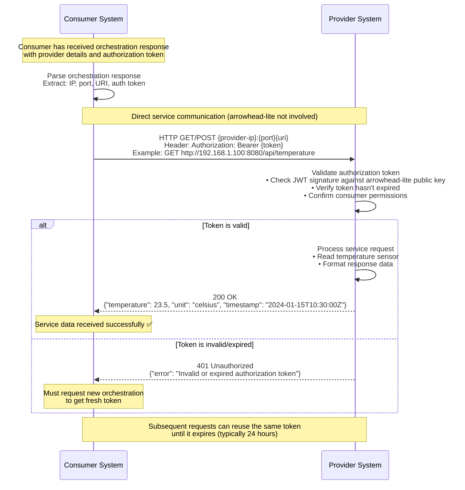

# Diagram 4: Direct Service Consumption

This diagram illustrates the final step in the interaction chain: direct communication between the consumer and the provider. A crucial concept in Arrowhead is that once orchestration is complete, the core system (`arrowhead-lite`) steps out of the way, and communication happens directly between the two edge systems. `arrowhead-lite` is a control plane, not a data plane proxy.

### Step-by-Step Explanation

1. **Parse Orchestration Response**: The `Consumer System` receives the successful response from the Orchestrator. It extracts the provider's connection details (address, port, service URI) and the `Authorization Token`.
2. **Direct API Call**: The `Consumer` makes a direct HTTP request to the `Provider System`'s endpoint.
3. **Include Token**: The `Consumer` includes the received `Authorization Token` in the `Authorization` header of the request (typically as a Bearer token). This token acts as a "ticket" proving that the interaction was approved by the Arrowhead core.
4. **Token Validation**: The `Provider System` receives the request. It is its responsibility to validate the token. This usually involves checking the token's signature against `arrowhead-lite`'s public JWT key, which it should be configured to trust.
5. **Service Execution & Response**: If the token is valid, the `Provider` trusts that the consumer is authorized. It executes the requested service (e.g., reads a sensor value) and returns the data in a direct HTTP response back to the `Consumer`.

## Key Concepts

1. **Direct Communication**: After orchestration, arrowhead-lite is not involved in service calls
2. **Token-Based Auth**: Provider validates JWT tokens independently
3. **Stateless**: Each service call includes the authorization token
4. **Token Lifecycle**: Tokens have expiration times and must be refreshed via new orchestration

## Provider Token Validation

The provider system must:
- Verify JWT signature using arrowhead-lite's public key
- Check token expiration timestamp
- Validate consumer identity matches the requesting system
- Confirm service permissions are granted

## Error Scenarios

- **Invalid Token**: Token signature doesn't match or is malformed
- **Expired Token**: Token timestamp has passed expiration time  
- **Wrong Consumer**: Token was issued for a different consumer system
- **Service Mismatch**: Token doesn't grant access to the requested service