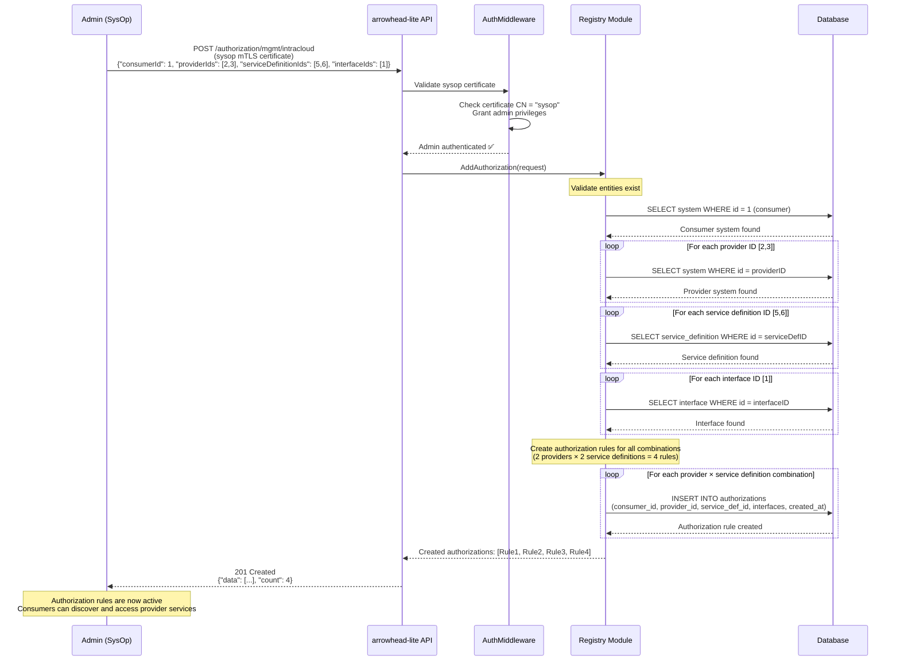

# Diagram 5: Creating an Authorization Rule

This diagram shows the administrative process of creating an access control rule. This is typically performed by a system operator or administrator using a client with special privileges (identified by the `sysop` certificate). This rule dictates which consumer systems are allowed to interact with which provider systems for a given service.

### Step-by-Step Explanation

1. **Request Initiation**: An `Admin (SysOp)` sends a `POST` request to the `/authorization/mgmt/intracloud` endpoint. The request payload contains the IDs of the consumer, provider(s), and service definition(s) for which the rule should apply. The request is authenticated using the powerful `sysop` client certificate.
2. **Authentication**: The `arrowhead-lite API` validates that the request is coming from a legitimate administrator by checking for a valid `sysop` certificate.
3. **Registry Logic**: The API handler calls the `Registry Module`'s `AddAuthorization` method.
4. **Entity Validation**: Before creating the rule, the `Registry Module` performs sanity checks. It queries the `Database` to ensure that the systems and services referenced by the provided IDs actually exist. This prevents the creation of orphaned or invalid rules.
5. **Database Write**: Once validated, the `Registry Module` inserts one or more new entries into the `authorizations` table in the `Database`.
6. **Confirmation**: A `201 Created` response, containing the details of the newly created rule(s), is returned to the `Admin (SysOp)`.

## Authorization Rule Components

1. **Consumer System**: The system requesting access to services
2. **Provider System(s)**: The system(s) offering services
3. **Service Definition(s)**: The specific service type(s) being authorized
4. **Interface(s)**: The communication protocols allowed (HTTP-SECURE-JSON, etc.)

## Multiple Rule Creation

As of the recent enhancement, a single authorization request can create multiple rules:
- **Cross Product**: All combinations of providers × service definitions
- **Batch Operation**: Efficient creation of related authorization rules
- **Atomic Transaction**: All rules created together or none at all

## Admin Privileges

The sysop certificate grants special privileges:
- **System Management**: Register/unregister any system
- **Service Management**: Register/unregister any service  
- **Authorization Control**: Create/delete authorization rules
- **Global Access**: No authorization checks for sysop operations

## Rule Validation

Before creating rules, the system validates:
- ✅ Consumer system exists and is registered
- ✅ All provider systems exist and are registered
- ✅ All service definitions exist in the registry
- ✅ All specified interfaces are supported
- ❌ Duplicate rules are rejected (unique constraint)